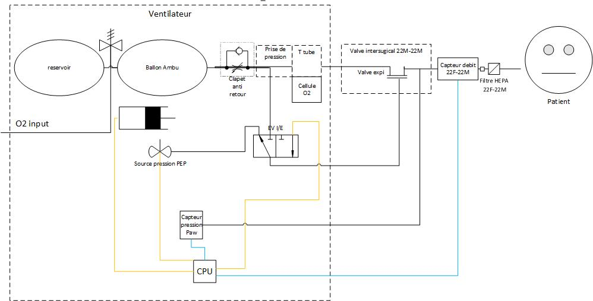

# Controller
Sensors, electro-valves and controller

## Recovid-synoptique

## lexique
|    Nom|definition|range | resolution|
|----------------|-------------------------------|-----------------------------|-----------------------------|
| Paw | pression voie aerienne (en cmH20) |-2 ; 100| 0.1|
| QPatientSLM | debit patient a 21°C et 1013hPa|-200 ; 200|0.1|
| QPatientBTPS | debit Patient a 37°C, Pression ambiante et 100% Humidite (breath Temperature and pressure saturated)|-200 ; 200|0.1|
| RawO2 | tension qui sort de la cellule O2 |||
| PAtmo Pression atmospherique (exprime en hpa)|0-1200|1|
| Ti | Temps d'inspiration(seconde)  = VT(en L)/Debit de pointe(L/Min)|0;2|0.1|
| VTi | volume tidal inspiratoire (ml)|0-1500|1|
| VTe | Volume tidal expiratoire (ml)|0-1500|1|

## principe de fonctionement

### sensing
en continu (1kHz) on lit  Paw et QPatientSLM

en continu (1Hz) on lit RawO2 et PAtmo

* O2Concentration = RawO2*Gain
* QPatientBTPS = QPatientSLM * 1013/(Patmo-62,66) * (310°K/294°K)
* VTi = integral de QPatientBTPS durant toute l'inspiration et a l'expiration jusqu'a ce que le debit repasse en negatif
* VTe = integrale de QPatientBTPS durant le reste du temps (Q negatif et positif)
* VMi = somme des 8 derniers VTi * frequence respiratoire/8 
* VMe = somme des 8 derniers VTe * frequence respiratoire/8
* PEP = moyenne de Paw durant les 100 derniere ms de l'expi 
* PPlat = moyenne de Paw durant les 50 derniere ms du plateau ou de la pause inspiratoire
* PPeak = max de Paw durant inspiration + 100ms
* FiO2 = moyenne de O2Concentration sur le cycle 

### therapie
Inspiration :
* on ferme l'electovalve I/E (Valve expi connecte a la sortie du ballon)
* on actionne le ballon pendant le temps Ti a la vitesse determiné (pas de controle durant le cycle)
* apres le Ti on commence a faire revenir le ballon mais on garde l'electrovanne fermé durant le temps de plateau ou le temps de la pause inpiratoire (tant que le medecin a le bouton appuyé) puis passage a l'expiration.

Expiration 
* On ouvre l'electrovanne (plutot simple)
* si le medecin appuie sur pause expiratoire on ferme la l'electrovanne tant qu'il est appuye dessus

### regulation 
cycle a cycle pour la PEP et le VT 
* on ajuste la commande de PEP une fois qu'on a la mesure du cycle (a la fin de l'expi pour avoir le temps d'atteindre la pression de commande)
* pour le VT on va ajuster le nombre de tour de consigne (attention a ne pas compenser tout d'un coup) 

Pour le moment je pense qu'il faut avoir une vitesse constante. je ne pense pas qu'il soit necessaire de viser une forme de debit precise.

###Calibration O2
c'est une procedure a part ou l'on met la cellule O2 à l'air (pendant 2minute au minimum) et on prend la valeur RawO2 et Patmo a la fin des 2 minutes. a faire avant le debut de la ventilation probablement en assurant un passage d'air devant la cellule pour flusher toute trace d'O2.

