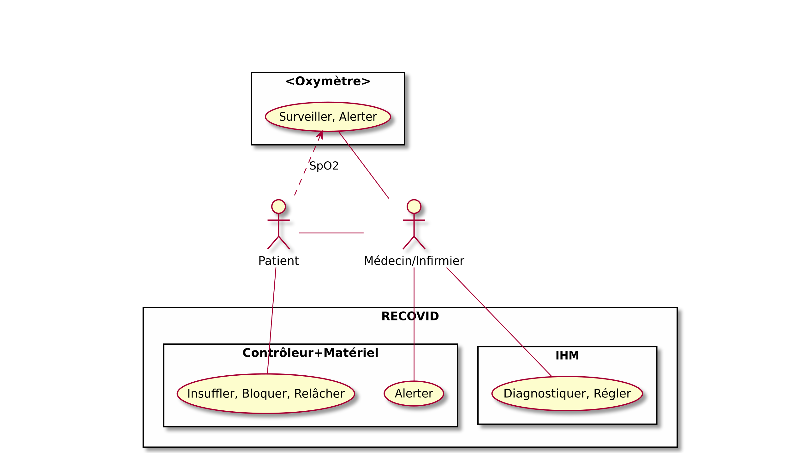
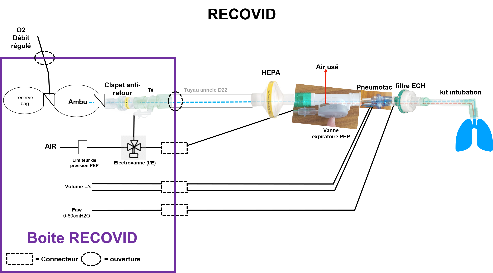
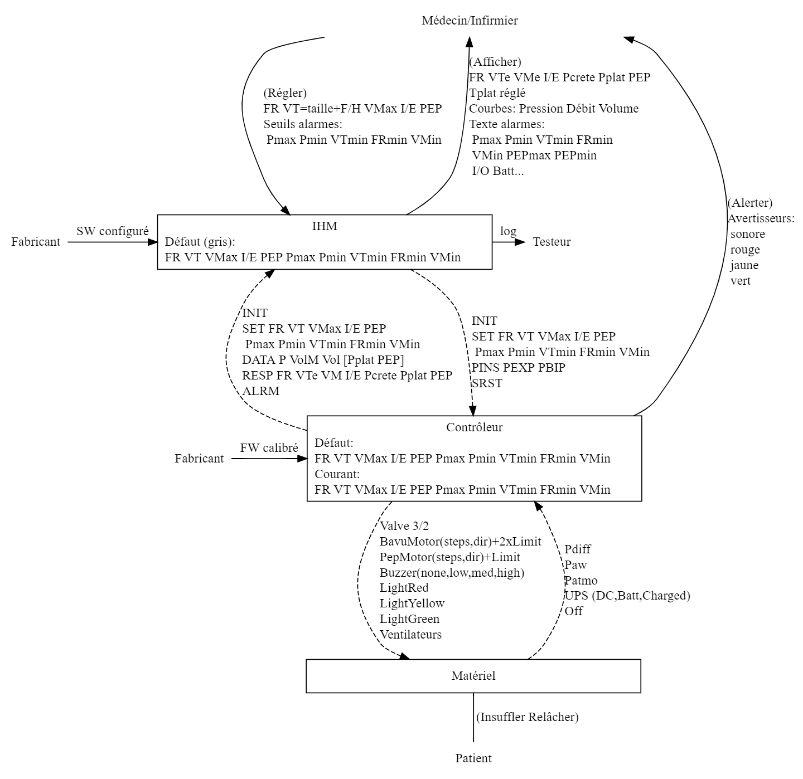
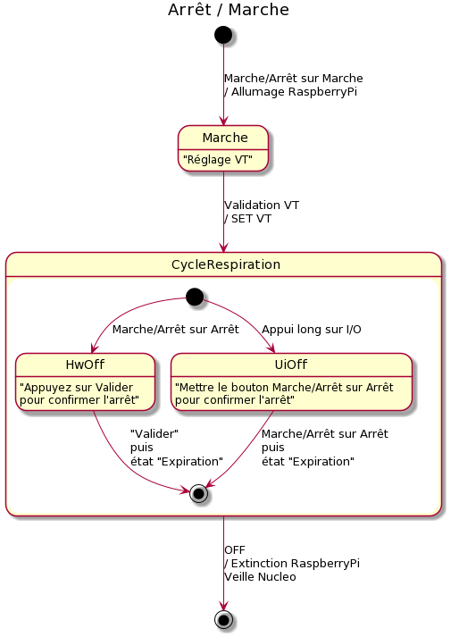
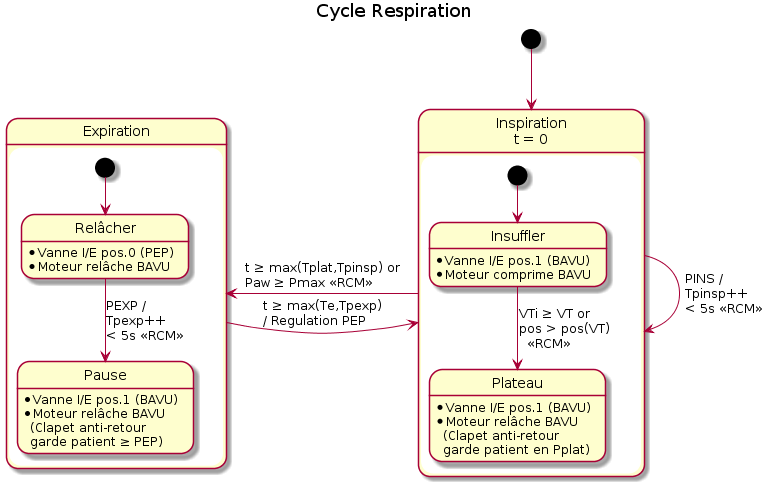
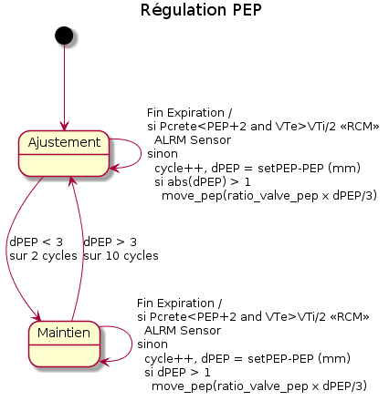

# Overview of Controller v2 design

## Use cases

Le RECOVID ne peut être utilisé que conjointement à un Oxymètre médical qui mesure, surveille et alerte le taux d'oxygénation du patient. Le Contrôleur est responsable d'assurer le cycle respiratoire (Insuffler, Relâcher) à une fréquence de 12 à 35 fois par minute H24 jusqu'à 14j d'affilées et d'alerter sur le moindre écart. L'IHM est nécessaire pour que le soignant analyse et ajuste les paramètres de la respiration (ce qui est tout de même moins critique).

## Hardware

## Information flow

## State machines specifications

