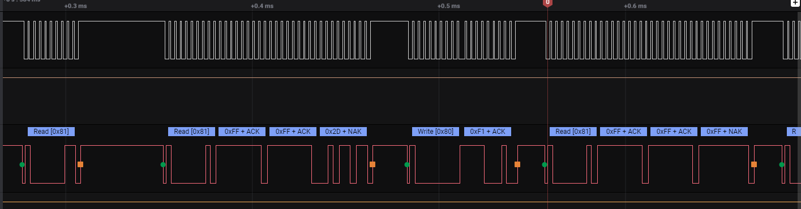
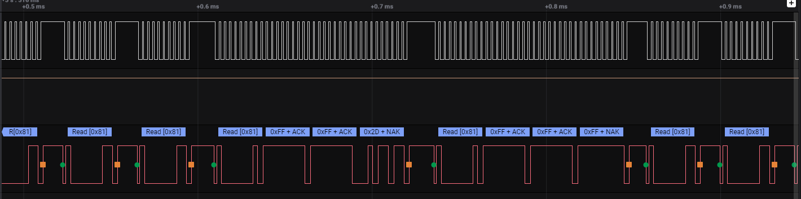

Note sur le fonctionnement constaté du capteur de flux SDP610 :

Pré-requis : La discussion suivante s'entend après avoir paramétré le
SDP610 pour qu'il ne garde pas le bus en attendant d'avoir une valeur
disponible.

-   L'envoi successif de trames REQ (0xF1) entraine systématiquement un
    NAK.

-   Le firmware actuel (26/04/2020) montre que le fonctionnement suivant
    fonctionne :

    1.  1 trame REQ acquitée

    2.  N trames READ non acquitées

    3.  1 trame READ acquitée avec lecture de la valeur en suivant.

    4.  1 trame REQ.

    5.  La trame READ suivante est acquitée et renvoie 0xFFFFFF.

    6.  Retour en 2.

Exemple :

-   L'expérience montre (je ne dispose pas de la documentation qui
    précise le fonctionnement après le paramétrage spécifique spécifié
    en pré-requis) que le fonctionnement suivant fonctionne aussi (plus
    simple) :

    1.  1 trame REQ acquitée

    2.  N trames READ non acquitées

    3.  1 trame READ acquitée avec lecture de la valeur en suivant.

    4.  La trame READ suivante est acquitée et renvoie 0xFFFFFF.

    5.  Retour en 2.

> Exemple :

