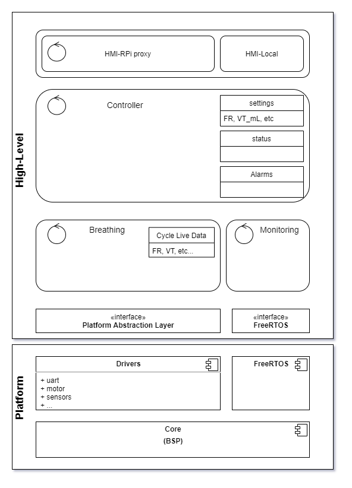

# 1/ Contributing

Contributions are very welcome.

Coding rules are not yet defined, but will soon be reenforced to aim at the BARR-C 2018 compliance.
Once all source code is compliant with BARR-C 2018 and since this is a critical firmware, we might end up targeting the MISRA-C 2012.

## 1.1/ Coding rules
As a starting points, here are the first important points to take into account:

### 1.1/ Numerical data types
All numerical datatypes MUST used the fixed length format:
````c
uint32_t  my_unsigned_variable;
int16_t   my_signed_variable;
float32_t a_float_variable;
````

### 1.2/ header files
header files MUST have the following structure:

````c
#ifndef __XXXX_H__
#define __XXXX_H__

//********************************************************************************
// Public dependencies                                                                      
// Only the strict minimum of dependencies MUST be included                    
// "common.h" provides all common project dependencies and should be sufficient. 
//********************************************************************************
#include "common.h"

//********************************************************************************
// Public defines and types
//********************************************************************************

#define MAX_PAYLOAD_LEN     (25)

typedef struct {
  uint8_t  command_id;
  uint16_t payload_len;
} message_header_t;


//********************************************************************************
// Public variables
//********************************************************************************

extern uint32_t g_my_public_counter;

//********************************************************************************
// Public functions
//********************************************************************************

void my_public_function(bool activate);

#endif
````

### 1.3/ source files
source files MUST have the following structure:
````c
/*******************************************************
 * name:
 * desc:
 * 
 * *****************************************************/

//********************************************************************************
// Private dependencies                                                                      
// Only the strict minimum of dependencies MUST be included                    
// "common.h" provides all common project dependencies and should be sufficient. 
//********************************************************************************
#include "common.h"
#include "my_public_itf.h"   // The module public interface
...

//********************************************************************************
// Private defines and types
//********************************************************************************

#define MAX_PAYLOAD_LEN     (25)

typedef struct {
  uint32_t  something;
  uint32_t  something_else;
  ...
} my_private_type_t;


//********************************************************************************
// Private variables
//********************************************************************************

static uint32_t g_my_private_counter;

//********************************************************************************
// Private functions prototypes
//********************************************************************************

static float32_t my_private_function(my_private_type_t *p_var);


//********************************************************************************
// Public variable
//********************************************************************************

uint32_t g_my_public_counter;


//********************************************************************************
// Public functions implementation
//********************************************************************************

void my_public_function(bool activate) {

}

//********************************************************************************
// Private functions implementation
//********************************************************************************

static float32_t my_private_function(my_private_type_t *p_var) {
  
}

````


# 2/ Firmware design overview




The firmware is composed of 2 main layers:
* the "high-level" layer in charge of implementing all business tasks and processes.
* the "platform" layer which provides the OS and all the drivers for the underlying hardware components.


## 2.1/ The high-level layer

### 2.1.1/ *Controller.*
This is the central component of the system. 
It is in charge of:
* controlling the overall system state (on/off/breathing) 
* monitoring the system health (battery and UPS).
* interacting with the user thru the HMI (local and remote).

### 2.1.2/ *HMI.*
The HMI component has 2 modules: 
* A local one (on/off button, buzzers and lights) simply managed thru hardware I/O
* A remote one (RPi HMI), which implements a serial protocol to communicate with the RPi.

### 2.1.3/ *Breathing.*
This component if the heart of Recovid and implements the breathing state machine.
It takes its input from the controller, reports its current cycle phase to the system with signals.
At the begining of each cycle, it adapts its motor command, to meet the current settings.
At the end of each breathing cycle, it inform the system of the result (computed data) of the cycle.

### 2.1.4/ *Monitor*
This component is a supervisor for the breathing task, and has the highest priority in the system, to be able to undertake all necessary action in case of detected problem.


## 2.2/ The platform layer.
This layer is a pluggable layer. Various implementation can be provided, as long as they provide the same platform abstraction interface and the FreeRTOS implementation.
For now, 2 platforms are available:
* A simulator which is not yet functionnal
* A real implementation base on the recovid_revB board working with a Nucleo-F303RE board (STM32).


---
# 3/ Building the firmware

To build the firmware, you'll need a development environment composed of:
* the arm gcc 7.3 [Toolchain](https://developer.arm.com/tools-and-software/open-source-software/developer-tools/gnu-toolchain/gnu-rm/downloads/7-2018-q2-update)
* cmake (>=3.12)
* a recent version of [openocd](http://openocd.org/getting-openocd/) or [stlink-tools](https://github.com/stlink-org/stlink) or [STM32CubeProgrammer]()
* standard build tools (make, etc...)

If you have already installed [STM32CubeIDE](https://www.st.com/en/development-tools/stm32cubeide.html), you can setup your environment from it.
* toolchain : 

<STM32CubeIDE_install_path>/plugins/com.st.stm32cube.ide.mcu.externaltools.gnu-tools-for-stm32.7-2018-q2-update.win32_1.0.0.201904181610/tools/bin

* build tools (windows) : 

<STM32CubeIDE_install_path>/plugins/com.st.stm32cube.ide.mcu.externaltools.make.win32_1.1.0.201910081157/tools/bin

* openocd (linux) : 

<STM32CubeIDE_install_path>/plugins/com.st.stm32cube.ide.mcu.externaltools.openocd.linux64_1.3.0.202002181050/tools/bin/

* STM32CubeProgrammer : 

<STM32CubeIDE_install_path>/plugins/com.st.stm32cube.ide.mcu.externaltools.cubeprogrammer.win32_1.3.0.202002181050/tools/bin


## 3.1/ Building on windows

````bash
set STM32CubePath="<PATH_TO_STM32CubeIDE>"
rem Add cross toolchain to your path
set PATH=%PATH%;%STM32CubePath%\plugins\com.st.stm32cube.ide.mcu.externaltools.gnu-tools-for-stm32.7-2018-q2-update.win32_1.0.0.201904181610\tools\bin;
rem Add unix build tools (make, ...) to your path
set PATH=%PATH%;%STM32CubePath%\plugins\com.st.stm32cube.ide.mcu.externaltools.make.win32_1.1.0.201910081157\tools\bin;
rem Add STM32CubeProgrammer to your path
set PATH=%PATH%;%STM32CubePath%\plugins\com.st.stm32cube.ide.mcu.externaltools.cubeprogrammer.win32_1.3.0.202002181050\tools\bin;

#In the Controller/sources directory
git submodule update --init
mkdir build
cd build
#Run cmake to generate the makefile
cmake  -DTARGET=recovid_revB -DCMAKE_BUILD_TYPE=Debug -G"Unix Makefiles" ..
# make the binblob to flash
make -j8
make -j8 Controller.recovid_revB.elf.binary

#Flash IT
STM32_Programmer_CLI.exe -c port=SWD -hardRst
STM32_Programmer_CLI.exe -c port=SWD -rdu
STM32_Programmer_CLI.exe -c port=SWD -w  Controller.recovid_revB.elf.bin 0x8000000 --start

````


## 3.2/ Building on linux


````bash
#Add cross toolchain to your path
PATH=$PATH:/opt/st/stm32cubeide_1.3.0/plugins/com.st.stm32cube.ide.mcu.externaltools.gnu-tools-for-stm32.7-2018-q2-update.linux64_1.0.0.201904181610/tools/bin
#Add openocd to your path for flashing
PATH=$PATH:/opt/st/stm32cubeide_1.3.0/plugins/com.st.stm32cube.ide.mcu.externaltools.openocd.linux64_1.3.0.202002181050/tools/bin/
# in the Controller/sources directory
git submodule update --init # Initialize the submodules
mkdir build
cd build
#Run cmake to generate the makefile
cmake  -DTARGET=recovid_revB -DCMAKE_BUILD_TYPE=Debug -G"Unix Makefiles" ..
# make the binary
make -j16 C_Controller.stm32f303.elf
# and flash it using OpenOCD
make C_Controller.recovid_revB.elf.flash
````

